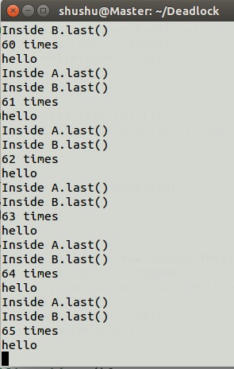
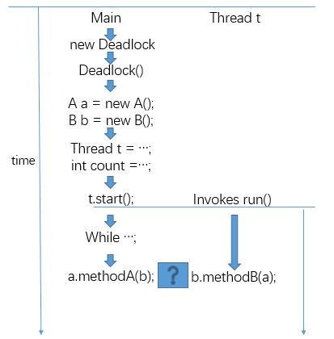

# Lab04:Deadlock

### 产生死锁的四个必要条件
> 死锁：指两个或两个以上的进程在执行过程中，互相请求对方的资源，从而造成阻塞的现象，并且若无外力帮助，会一直阻塞下去。

* 互斥条件(Mutual Exclusion)：一个资源每次只可以被一个进程使用
* 请求与保持条件(Hold and Wait)：一个进程因请求其他资源被阻塞时，不释放其已占有的资源
* 不剥夺条件(No Preemption)：对于进程已获得的资源，在进程未使用结束前，其他进程无法剥夺该资源，只能由该进程使用结束后对该资源进行释放
* 循环等待条件(Circular Wait)：若干进程之间形成一种头尾相接的循环等待资源关系

### 实验过程
1. 复制Deadlock.java文件
   > 关键字 synchronized:

    > 当它用来修饰一个方法或者一个代码块的时候，能够保证在同一时刻最多只有一个线程执行该段代码

    > 当一个线程访问object的一个synchronized同步代码块或同步方法时，其他线程对object中所有其它synchronized同步代码块或同步方法的访问将被阻塞

    ```java
    class A {
    	synchronized void methodA(B b){
    		int count = 40000;
    		while(count-->0);
    		b.last();
    	}

    	synchronized void last(){
    		System.out.println("Inside A.last()");
    	}
    }

    class B {
    	synchronized void methodB(A a){
    		int count = 40000;
    		while(count-->0);
    		a.last();
    	}
    
    	synchronized void last(){
    		System.out.println("Inside B.last()");
    	}
    }
    
    class Deadlock implements Runnable{
    	A a = new A();
    	B b = new B();
    
    	Deadlock(){
    		Thread t = new Thread(this);
    		int count = 5000000;
    		System.out.println("hello");
    		t.start();
    		while(count-->0);
    		a.methodA(b);
    	}
    
    	public void run(){
    		b.methodB(a);
    	}
    
    	public static void main(String args[]){
    		new Deadlock();
    	}
    }
    ```

2. 添加dl.sh文件
    ```
    #!/bin/bash

    for (( c=1; c<=100; c++))
    do
    	echo "$c times"
    	java Deadlock
    done
    ```

3. 编译运行
    ```
    $ javac Deadlock.java
    $ ./dl.sh
    ```

4. 不断修改class Deadlock中count的值，直到出现死锁为止，即输出的结果在100次之内停住
    > 尝试了将class Deadlock中的count值调得非常大，甚至接近了int的最大值，也没有出现死锁
    解决办法：
    > 在`class A`和`class B`中增加循环，延长`methodA()`和`methodB()`的执行时间，使得`methodA()`被调用的同时，`methodB()`也被调用，更易于产生死锁

    ```java
    class A {
    	synchronized void methodA(B b){
    		int count = 50000;
    		while(count-->0);
    		b.last();
    	}

    	synchronized void last(){
    		System.out.println("Inside A.last()");
    	}
    }

    class B {
    	synchronized void methodB(A a){
    		int count = 50000;
    		while(count-->0);
    		a.last();
    	}

    	synchronized void last(){
    		System.out.println("Inside B.last()");
    	}
    }
    ```

### 死锁停在了 65times




### 上述程序产生死锁的原因
首先函数`a.methodA(b)`和函数`b.methodB(a)`都是被关键字synchronized修饰
> 当它用来修饰一个方法或者一个代码块的时候，能够保证在同一时刻最多只有一个线程执行该段代码
    
> 当一个线程访问object的一个synchronized同步代码块或同步方法时，其他线程对object中所有其它synchronized同步代码块或同步方法的访问将被阻塞

主线程执行函数`a.methodA(b)`，t线程执行函数`b.methodB(a)`，当函数`a.methodA(b)`执行过程中需要调用函数`b.last()`，而t线程开始执行函数`b.methodB(a)`，所以主线程被阻塞，当t线程执行函数`b.methodB(a)`的过程中需要调用函数`a.last()`，由于主线程被阻塞了，所以t线程无法调用函数`a.last()`，所以t线程也被阻塞，从而产生死锁。

可以把b看成锁b，a看成锁a，也就是说，主线程拥有锁a，想要获得锁b，t线程拥有锁b，想要获得锁a。当主线程请求获得锁b时，由于t线程拥有锁b，所以主线程被阻塞。而t线程请求拥有锁a，由于主线程拥有锁a，所以t线程被阻塞，所以产生死锁。




