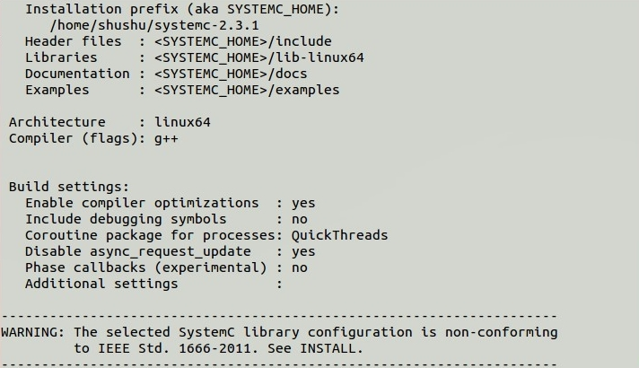
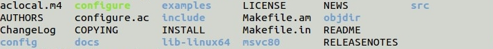
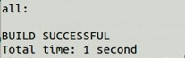
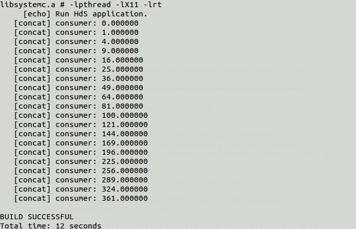

---

### **修改example1，输出3次方**
> tips:修改square.c

1. 修改部分
    因为square.c定义了square需要做什么。原本在该文件中定义了`i=i*i`，即运算平方。因为现在需要输入3次方，所以只需要将`i=i*i`修改为`i=i*i*i`，就能输出3次方了
    
2. 修改完的*.dot截图
    
3. 运行结果
    ```
    $ cd dol/build/bin/main
    $ sudo ant -f runexample.xml -Dnumber=1
    ```
    可以看到下图运行的结果是三次方：
    

---

### **修改example2,让square模块变为2个**
> tips：修改xml的iterator

1. 修改部分
    打开example.xml，我们可以看到``<variable value="3" name="N"/>``定义了square的数量是3，所以我们只需要将该语句的`value`值修改为2，就可以了
    
2. 修改完的*.dot截图
    
3. 运行结果
    ```
    $ cd dol/build/bin/main
    $ sudo ant -f runexample.xml -Dnumber=2
    ```
    可以看到下图运行的结果是四次方：
    

---

### **实验感想**
通过此次实验，了解到了example文件夹中各文件的含义
> src文件夹是包含了各进程的功能定义（生产者、消费者、处理程序等），我们可以通过查看这部分代码了解各进程实现的是什么功能，是如何实现的

> example1.xml是系统架构即模块连接的含义，我们可以通过查看这部分代码了解各进程是如何进行连接的

> 运行结果之前，要删除上一次运行结果生成的文件，不然可能运行的结果依然是上次的结果


